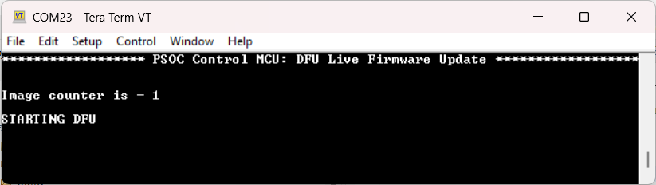
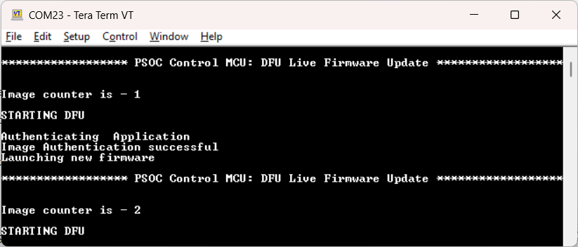

# PSOC&trade; Control MCU: DFU live firmware update

This code example demonstrates how to perform a firmware update without a device reset. The code example is based on Device Firmware Update (DFU) and Infineon MbedTLS libraries.

[View this README on GitHub.](https://github.com/Infineon/mtb-example-ce240679-live-fwu)

[Provide feedback on this code example.](https://cypress.co1.qualtrics.com/jfe/form/SV_1NTns53sK2yiljn?Q_EED=eyJVbmlxdWUgRG9jIElkIjoiQ0UyNDA2NzkiLCJTcGVjIE51bWJlciI6IjAwMi00MDY3OSIsIkRvYyBUaXRsZSI6IlBTT0MmdHJhZGU7IENvbnRyb2wgTUNVOiBERlUgbGl2ZSBmaXJtd2FyZSB1cGRhdGUiLCJyaWQiOiJ0ZWphcyBrYWRnYW9ua2FyIiwiRG9jIHZlcnNpb24iOiIxLjAuMCIsIkRvYyBMYW5ndWFnZSI6IkVuZ2xpc2giLCJEb2MgRGl2aXNpb24iOiJNQ0QiLCJEb2MgQlUiOiJJQ1ciLCJEb2MgRmFtaWx5IjoiUFNPQyJ9)


## Requirements

- [ModusToolbox&trade;](https://www.infineon.com/modustoolbox) v3.3 or later (tested with v3.3)
- Board support package (BSP) minimum required version: 1.0.3
- Programming language: C
- Associated parts: [PSOC&trade; Control C3 MCUs](https://www.infineon.com/cms/en/product/microcontroller/32-bit-psoc-arm-cortex-microcontroller/32-bit-psoc-control-arm-cortex-m33-mcu)


## Supported toolchains (make variable 'TOOLCHAIN')

- GNU Arm&reg; Embedded Compiler v11.3.1 (`GCC_ARM`) – Default value of `TOOLCHAIN`
- Arm&reg; Compiler v6.22 (`ARM`)
- IAR C/C++ Compiler v9.50.2 (`IAR`)


## Supported kits (make variable 'TARGET')

- [PSOC&trade; Control C3M5 Evaluation Kit](https://www.infineon.com/KIT_PSC3M5_EVK) (`KIT_PSC3M5_EVK`) – Default value of `TARGET`


## Hardware setup

This example uses the kit’s default configuration. See the kit user guide to ensure that the kit is configured correctly.


## Software setup

See the [ModusToolbox&trade; tools package installation guide](https://www.infineon.com/ModusToolboxInstallguide) for information about installing and configuring the tools package.

Install a terminal emulator if you don't have one. Instructions in this document use [Tera Term](https://teratermproject.github.io/index-en.html).

<details><summary><b>ModusToolbox&trade; Edge Protect Security Suite</b></summary>

1. Download and install the [Infineon Developer Center Launcher](https://www.infineon.com/cms/en/design-support/tools/utilities/infineon-developer-center-idc-launcher).

2. Login using your Infineon credentials.

3. Download and install the “ModusToolbox&trade; Edge Protect Security Suite” from Developer Center Launcher.
   
   > **Note:** The default installation directory of the Edge Protect Security Suite in Windows operating system is *C:/Users/`<USER>`/Infineon/Tools*.
   
4. After installing the Edge Protect Security Suite, add the Edge Protect tools executable to the system PATH variable.
    
   Edge Protect tools executable is located in *<Edge-Protect-Security-Suite-install-path>/ModusToolbox-Edge-Protect-Security-Suite-`<version>`/tools/edgeprotecttools/bin*.

</details>


## Using the code example


### Create the project

The ModusToolbox&trade; tools package provides the Project Creator as both a GUI tool and a command line tool.

<details><summary><b>Use Project Creator GUI</b></summary>

1. Open the Project Creator GUI tool.

   There are several ways to do this, including launching it from the dashboard or from inside the Eclipse IDE. For more details, see the [Project Creator user guide](https://www.infineon.com/ModusToolboxProjectCreator) (locally available at *{ModusToolbox&trade; install directory}/tools_{version}/project-creator/docs/project-creator.pdf*).

2. On the **Choose Board Support Package (BSP)** page, select a kit supported by this code example. See [Supported kits](#supported-kits-make-variable-target).

   > **Note:** To use this code example for a kit not listed here, you may need to update the source files. If the kit does not have the required resources, the application may not work.

3. On the **Select Application** page:

   a. Select the **Applications(s) Root Path** and the **Target IDE**.

   > **Note:** Depending on how you open the Project Creator tool, these fields may be pre-selected for you.

   b. Select this code example from the list by enabling its check box.

   > **Note:** You can narrow the list of displayed examples by typing in the filter box.

   c. (Optional) Change the suggested **New Application Name** and **New BSP Name**.

   d. Click **Create** to complete the application creation process.

</details>


<details><summary><b>Use Project Creator CLI</b></summary>

The 'project-creator-cli' tool can be used to create applications from a CLI terminal or from within batch files or shell scripts. This tool is available in the *{ModusToolbox&trade; install directory}/tools_{version}/project-creator/* directory.

Use a CLI terminal to invoke the 'project-creator-cli' tool. On Windows, use the command-line 'modus-shell' program provided in the ModusToolbox&trade; installation instead of a standard Windows command-line application. This shell provides access to all ModusToolbox&trade; tools. You can access it by typing "modus-shell" in the search box in the Windows menu. In Linux and macOS, you can use any terminal application.

The following example clones the "[Live firmware update](https://github.com/Infineon/mtb-example-psoc-c3-live-fwu)" application with the desired name "LiveFwUpdate" configured for the *KIT_PSC3M5_EVK* BSP into the specified working directory, *C:/mtb_projects*:

   ```
   project-creator-cli --board-id KIT_PSC3M5_EVK --app-id mtb-example-psoc-c3-live-fwu --user-app-name LiveFwUpdate --target-dir "C:/mtb_projects"
   ```

The 'project-creator-cli' tool has the following arguments:

Argument | Description | Required/optional
---------|-------------|-----------
`--board-id` | Defined in the <id> field of the [BSP](https://github.com/Infineon?q=bsp-manifest&type=&language=&sort=) manifest | Required
`--app-id`   | Defined in the <id> field of the [CE](https://github.com/Infineon?q=ce-manifest&type=&language=&sort=) manifest | Required
`--target-dir`| Specify the directory in which the application is to be created if you prefer not to use the default current working directory | Optional
`--user-app-name`| Specify the name of the application if you prefer to have a name other than the example's default name | Optional

<br>

> **Note:** The project-creator-cli tool uses the `git clone` and `make getlibs` commands to fetch the repository and import the required libraries. For details, see the "Project creator tools" section of the [ModusToolbox&trade; tools package user guide](https://www.infineon.com/ModusToolboxUserGuide) (locally available at {ModusToolbox&trade; install directory}/docs_{version}/mtb_user_guide.pdf).

</details>


### Open the project

After the project has been created, you can open it in your preferred development environment.


<details><summary><b>Eclipse IDE</b></summary>

If you opened the Project Creator tool from the included Eclipse IDE, the project will open in Eclipse automatically.

For more details, see the [Eclipse IDE for ModusToolbox&trade; user guide](https://www.infineon.com/MTBEclipseIDEUserGuide) (locally available at *{ModusToolbox&trade; install directory}/docs_{version}/mt_ide_user_guide.pdf*).

</details>


<details><summary><b>Visual Studio (VS) Code</b></summary>

Launch VS Code manually, and then open the generated *{project-name}.code-workspace* file located in the project directory.

For more details, see the [Visual Studio Code for ModusToolbox&trade; user guide](https://www.infineon.com/MTBVSCodeUserGuide) (locally available at *{ModusToolbox&trade; install directory}/docs_{version}/mt_vscode_user_guide.pdf*).

</details>


<details><summary><b>Keil µVision</b></summary>

Double-click the generated *{project-name}.cprj* file to launch the Keil µVision IDE.

For more details, see the [Keil µVision for ModusToolbox&trade; user guide](https://www.infineon.com/MTBuVisionUserGuide) (locally available at *{ModusToolbox&trade; install directory}/docs_{version}/mt_uvision_user_guide.pdf*).

</details>


<details><summary><b>IAR Embedded Workbench</b></summary>

Open IAR Embedded Workbench manually, and create a new project. Then select the generated *{project-name}.ipcf* file located in the project directory.

For more details, see the [IAR Embedded Workbench for ModusToolbox&trade; user guide](https://www.infineon.com/MTBIARUserGuide) (locally available at *{ModusToolbox&trade; install directory}/docs_{version}/mt_iar_user_guide.pdf*).

</details>


<details><summary><b>Command line</b></summary>

If you prefer to use the CLI, open the appropriate terminal, and navigate to the project directory. On Windows, use the command-line 'modus-shell' program; on Linux and macOS, you can use any terminal application. From there, you can run various `make` commands.

For more details, see the [ModusToolbox&trade; tools package user guide](https://www.infineon.com/ModusToolboxUserGuide) (locally available at *{ModusToolbox&trade; install directory}/docs_{version}/mtb_user_guide.pdf*).

</details>


## Operation

1. Connect the board to your PC using the provided USB cable through the KitProg3 USB connector.

2. Open a terminal program and select the KitProg3/JLink COM port. Set the serial port parameters to 8N1 and 115200 baud.

3. The device must be provisioned with the correct policy. Follow these steps to provision the device.

   1. Add policy and keys to the project.

      1. Ensure that you are in the *`<Workspace>/<CodeExampleName>`* directory.

      2. Execute the following command to add policy and keys to the project:
         ```
         edgeprotecttools -t psoc_c3 init
         ```

         > **Note:** After executing of the `init` command, all files that are required for provisioning will be copied into the *`<Workspace>/<CodeExampleName>`* directory, including the default policy for the chosen `<kit-name>`.

   2. Add the keys to be used for provision of device into the project.

      Generate keys using the following command:

      ```
      edgeprotecttools create-key --key-type ECDSA-P256 -o keys/oem_rot_priv_key_0.pem keys/oem_rot_pub_key_0.pem
      ````
      ```
      edgeprotecttools create-key --key-type ECDSA-P256 -o keys/oem_rot_priv_key_1.pem keys/oem_rot_pub_key_1.pem
      ```

   3. OEM provisioning.

      The default OEM policy configures the device in single bank mode. To perform a live firmware upgrade, modify the OEM policy. A modified OEM policy is supplied with this code example which sets the device in dual bank mode. The OEM policy is available here *`<Workspace>/<CodeExampleName>`/dual_bank_policy/policy_oem_provisioning.json*.

      To provision the device, execute the following command:
      ```
      edgeprotecttools -t psoc_c3 provision-device -p dual_bank_policy/policy_oem_provisioning.json
      ```


4. Program the board using one of the following:

   <details><summary><b>Using Eclipse IDE</b></summary>

      1. Select the application project in the Project Explorer.

      2. In the **Quick Panel**, scroll down, and click **\<Application Name> Program (KitProg3_MiniProg4)**.
   </details>


   <details><summary><b>In other IDEs</b></summary>

   Follow the instructions in your preferred IDE.
   </details>


   <details><summary><b>Using CLI</b></summary>

     From the terminal, execute the `make program` command to build and program the application using the default toolchain to the default target. The default toolchain is specified in the application's Makefile but you can override this value manually:
      ```
      make program TOOLCHAIN=<toolchain>
      ```

      Example:
      ```
      make program TOOLCHAIN=GCC_ARM
      ```
   </details>

5. After programming, the application starts automatically. Confirm that "PSOC Control MCU: DFU Live Firmware Update" is displayed on the UART terminal and the user LED is blinking at a 0.5 Hz frequency.

   **Figure 1. Terminal output on program startup**

   


6. Update the `IMG_TYPE` to `UPDATE` in application's Makefile and clean build the application.

7. Open the DFU Host Tool from ModusToolbox&trade; IDE and select the newly built UPDATE image hex file to program. Set the transport to I2C and configure the address to '8', I2C speed to '100 kHz' in DFU Host Tool and initiate programming operation.

8. Once the new firmware is downloaded successfully, the application will authenticate the firmware and launch the new application.

   **Figure 1. Terminal output on firmware update**

   

9. Confirm that the "Image  counter" is **2** and the user LED is blinking at a 2 Hz frequency.

10. (Optional). Enable secured boot.

      If secured boot is enabled, the ROM boot expects a signed image in MCUboot format. To enable secured boot, provision the device with the appropriate OEM policy. A sample policy *`<Workspace>/<CodeExampleName>`/dual_bank_policy/policy_oem_provisioning_secured_boot.json* is provided as reference. To enable a live firmware update, provision the device with *policy_oem_provisioning_secured_boot.json* policy and set the **SECURED_BOOT** to **TRUE** in *`<Workspace>/<CodeExampleName>`/Makefile*.

      Once secured boot is enabled, follow the earlier steps to perform the update.


## Debugging

You can debug the example to step through the code.


<details><summary><b>In Eclipse IDE</b></summary>

Use the **\<Application Name> Debug (KitProg3_MiniProg4)** configuration in the **Quick Panel**. For details, see the "Program and debug" section in the [Eclipse IDE for ModusToolbox&trade; user guide](https://www.infineon.com/MTBEclipseIDEUserGuide).

Use the **\<Application Name> Debug (JLink)** configuration in the **Quick Panel**. For details, see the "Program and debug" section in the [Eclipse IDE for ModusToolbox&trade; user guide](https://www.infineon.com/MTBEclipseIDEUserGuide).


</details>


<details><summary><b>In other IDEs</b></summary>

Follow the instructions in your preferred IDE.

</details>


## Design and implementation

This code example demonstrates a live firmware update using the dual bank feature of PSOC&trade; Control MCU. In dual bank mode, the flash is divided into two equal sized banks called as "bank 0" and "bank 1". The two banks have separate address mapping and are not contiguous in address space (0x1200_0000 – 0x1202_0000 and 0x1280_0000 – 0x1282_0000). Two mapping modes are available in dual bank mode - mapping A and mapping B. In mapping A, the bank 0 is available at lower address and bank 1 is at higher address. In mapping B, bank 0 is at higher address and bank 1 is at lower address. The bank at lower address is referred as "Main Bank" and the one at higher address is referred as "Alternate Bank".

The bank mode and mapping mode can be controlled via the OEM policy, which must be injected in the device through provisioning. The configuration provided in the policy is applied by the boot ROM during the device boot process. A policy is provided along with this code example which can enable the dual bank mode. To perform a live firmware update, active firmware is placed and executed from Main bank while the new firmware is downloaded in Alternate bank via I2C using DFU middleware.

The bank selection is performed by boot ROM based on "boot_dual_bank_enable" and "boot_bank_ctr_offset" parameter set in policy. By default "boot_bank_ctr_offset" is set to 0x270 for unsigned images and 0x670 for signed image.

When the BOOT image is programmed, the boot ROM authenticates (if secured boot is enabled) and launches the firmware. The BOOT image prints its counter value on the UART terminal and starts the DFU process to download the new UPDATE firmware. The firmware can be sent to the device via DFU Host Tool. Once the download operation is complete, the BOOT application authenticates the new firmware using PSA Crypto APIs (if secured boot is enabled) and changes the dual bank mapping. If the device is in mapping A, it is changed to mapping B and if the device was in mapping B, it is changed to mapping A. The mapping is toggled to ensure that the UPDATE image always launches from Main bank (bank at lower address). After updating the mapping, the BOOT image calls the Reset_Handler of UPDATE image to launch the new firmware without a reset. When the new firmware boots up from Main bank (the bank at lower address), it prints the new dual bank counter value to indicate that the update is successful. In case the device is power-cycled, the boot ROM compares the dual bank counter of BOOT and UPDATE image. As the UPDATE image has a higher counter value, the ROM authenticates and launches the new UPDATE firmware.

The code example works for both signed and unsigned images, which can be specified with **SECURED_BOOT** parameter in the application's Makefile.

> **Note:** To build the UPDATE image, the load address must always be set to Alternate bank address and Execution address set to Main bank address.


### Resources and settings

**Table 1. Application resources**

 Resource  |  Alias/object     |    Purpose
 :--------------------| :--------------------| :----------------------------------
 UART (PDL)|cy_retarget_io_uart_obj| UART object used by Retarget-IO for the Debug UART port
 I2C (DFU)    | DFU_I2C     | I2C for firmware download

<br>


## Related resources


Resources  | Links
-----------|----------------------------------
Application notes  | [AN238329](https://www.infineon.com/cms/en/product/microcontroller/32-bit-psoc-arm-cortex-microcontroller/32-bit-psoc-control-arm-cortex-m33-mcu/psoc-control-c3m/#!documents) – Getting started with PSOC&trade; Control C3 MCU on ModusToolbox&trade; software
Code examples  | [Using ModusToolbox&trade;](https://github.com/Infineon/Code-Examples-for-ModusToolbox-Software) on GitHub
Device documentation | [PSOC&trade; Control C3 MCU documents](https://www.infineon.com/cms/en/product/microcontroller/32-bit-psoc-arm-cortex-microcontroller/32-bit-psoc-control-arm-cortex-m33-mcu/psoc-control-c3m/#!documents)
Development kits | Select your kits from the [Evaluation board finder](https://www.infineon.com/cms/en/design-support/finder-selection-tools/product-finder/evaluation-board).
Libraries on GitHub  | [mtb-pdl-cat1](https://github.com/Infineon/mtb-pdl-cat1) – Peripheral Driver Library (PDL) <br> [mtb-hal-psc3](https://github.com/Infineon/mtb-hal-psc3) – Hardware Abstraction Layer (HAL) Library <br> [retarget-io](https://github.com/Infineon/retarget-io) – Utility library to retarget STDIO messages to a UART port
Tools  | [ModusToolbox&trade;](https://www.infineon.com/modustoolbox) – ModusToolbox&trade; software is a collection of easy-to-use libraries and tools enabling rapid development with Infineon MCUs for applications ranging from wireless and cloud-connected systems, edge AI/ML, embedded sense and control, to wired USB connectivity using PSOC&trade; Industrial/IoT MCUs, AIROC&trade; Wi-Fi and Bluetooth&reg; connectivity devices, XMC&trade; Industrial MCUs, and EZ-USB&trade;/EZ-PD&trade; wired connectivity controllers. ModusToolbox&trade; incorporates a comprehensive set of BSPs, HAL, libraries, configuration tools, and provides support for industry-standard IDEs to fast-track your embedded application development.

<br>


## Other resources

Infineon provides a wealth of data at [www.infineon.com](https://www.infineon.com) to help you select the right device, and quickly and effectively integrate it into your design.


## Document history


Document title: *CE240679* - *PSOC&trade; Control MCU: DFU live firmware update*

 Version | Description of change
 ------- | ---------------------
 1.0.0   | New code example
<br>


All referenced product or service names and trademarks are the property of their respective owners.

The Bluetooth&reg; word mark and logos are registered trademarks owned by Bluetooth SIG, Inc., and any use of such marks by Infineon is under license.


---------------------------------------------------------

© Cypress Semiconductor Corporation, 2024. This document is the property of Cypress Semiconductor Corporation, an Infineon Technologies company, and its affiliates ("Cypress").  This document, including any software or firmware included or referenced in this document ("Software"), is owned by Cypress under the intellectual property laws and treaties of the United States and other countries worldwide.  Cypress reserves all rights under such laws and treaties and does not, except as specifically stated in this paragraph, grant any license under its patents, copyrights, trademarks, or other intellectual property rights.  If the Software is not accompanied by a license agreement and you do not otherwise have a written agreement with Cypress governing the use of the Software, then Cypress hereby grants you a personal, non-exclusive, nontransferable license (without the right to sublicense) (1) under its copyright rights in the Software (a) for Software provided in source code form, to modify and reproduce the Software solely for use with Cypress hardware products, only internally within your organization, and (b) to distribute the Software in binary code form externally to end users (either directly or indirectly through resellers and distributors), solely for use on Cypress hardware product units, and (2) under those claims of Cypress's patents that are infringed by the Software (as provided by Cypress, unmodified) to make, use, distribute, and import the Software solely for use with Cypress hardware products.  Any other use, reproduction, modification, translation, or compilation of the Software is prohibited.
<br>
TO THE EXTENT PERMITTED BY APPLICABLE LAW, CYPRESS MAKES NO WARRANTY OF ANY KIND, EXPRESS OR IMPLIED, WITH REGARD TO THIS DOCUMENT OR ANY SOFTWARE OR ACCOMPANYING HARDWARE, INCLUDING, BUT NOT LIMITED TO, THE IMPLIED WARRANTIES OF MERCHANTABILITY AND FITNESS FOR A PARTICULAR PURPOSE.  No computing device can be absolutely secure.  Therefore, despite security measures implemented in Cypress hardware or software products, Cypress shall have no liability arising out of any security breach, such as unauthorized access to or use of a Cypress product. CYPRESS DOES NOT REPRESENT, WARRANT, OR GUARANTEE THAT CYPRESS PRODUCTS, OR SYSTEMS CREATED USING CYPRESS PRODUCTS, WILL BE FREE FROM CORRUPTION, ATTACK, VIRUSES, INTERFERENCE, HACKING, DATA LOSS OR THEFT, OR OTHER SECURITY INTRUSION (collectively, "Security Breach").  Cypress disclaims any liability relating to any Security Breach, and you shall and hereby do release Cypress from any claim, damage, or other liability arising from any Security Breach.  In addition, the products described in these materials may contain design defects or errors known as errata which may cause the product to deviate from published specifications. To the extent permitted by applicable law, Cypress reserves the right to make changes to this document without further notice. Cypress does not assume any liability arising out of the application or use of any product or circuit described in this document. Any information provided in this document, including any sample design information or programming code, is provided only for reference purposes.  It is the responsibility of the user of this document to properly design, program, and test the functionality and safety of any application made of this information and any resulting product.  "High-Risk Device" means any device or system whose failure could cause personal injury, death, or property damage.  Examples of High-Risk Devices are weapons, nuclear installations, surgical implants, and other medical devices.  "Critical Component" means any component of a High-Risk Device whose failure to perform can be reasonably expected to cause, directly or indirectly, the failure of the High-Risk Device, or to affect its safety or effectiveness.  Cypress is not liable, in whole or in part, and you shall and hereby do release Cypress from any claim, damage, or other liability arising from any use of a Cypress product as a Critical Component in a High-Risk Device. You shall indemnify and hold Cypress, including its affiliates, and its directors, officers, employees, agents, distributors, and assigns harmless from and against all claims, costs, damages, and expenses, arising out of any claim, including claims for product liability, personal injury or death, or property damage arising from any use of a Cypress product as a Critical Component in a High-Risk Device. Cypress products are not intended or authorized for use as a Critical Component in any High-Risk Device except to the limited extent that (i) Cypress's published data sheet for the product explicitly states Cypress has qualified the product for use in a specific High-Risk Device, or (ii) Cypress has given you advance written authorization to use the product as a Critical Component in the specific High-Risk Device and you have signed a separate indemnification agreement.
<br>
Cypress, the Cypress logo, and combinations thereof, ModusToolbox, PSoC, CAPSENSE, EZ-USB, F-RAM, and TRAVEO are trademarks or registered trademarks of Cypress or a subsidiary of Cypress in the United States or in other countries. For a more complete list of Cypress trademarks, visit www.infineon.com. Other names and brands may be claimed as property of their respective owners.

